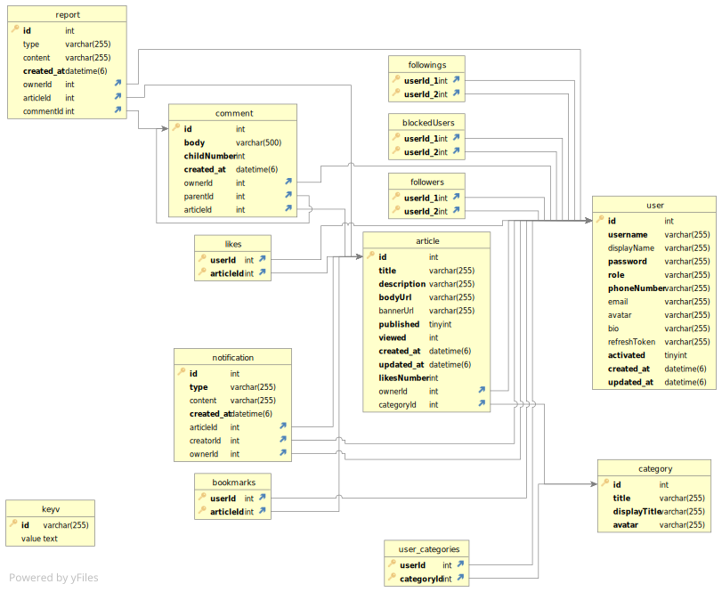

## Description

Articlesland backend repository.

## Database ERD



## Installation

```bash
$ npm install
```

## Running the app

```bash
# development
$ npm run start

# watch mode
$ npm run start:dev

# production mode
$ npm run start:prod
```

## Documentations

APIs Documentations:
http://localhost:8080/swagger

Code Documentations:

```bash
$ npm run compodoc
```
then you can see documentations at: http://localhost:8081


## Test

```bash
# unit tests
$ npm run test

# e2e tests
$ npm run test:e2e

# test coverage
$ npm run test:cov
```

